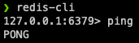
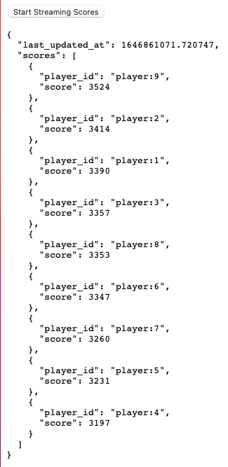

# Real-Time Leaderboard Walkthrough
Welcome! This repository is an example of a simple implementation of a leaderboard/scoreboard using Python, JavaScript, and Redis.

**Disclaimer**: This repository is for educational purposes and is not meant for production deployment. 

## Installation
### Local Redis Server 
1. Run `brew install redis`
2. Open a terminal window, and execute `redis-cli`.
3. Type _ping_, and Redis should respond with _PONG_.

&ensp;&ensp;&ensp;&ensp;&ensp;&ensp;&ensp;&ensp;
### Cloning the Repository
Using a terminal window, `cd` into your preferred directory, and execute the following command:
```
git clone https://github.com/bryangalindo/leaderboard-example.git
```
### Setting Up the Development Environment
In this section, we'll set up a Python virtual environment and install the required packages.
```
cd leaderboard-example
python3 -m venv venv
source ./venv/bin/activate
pip install -r 'requirements.txt'
```
### Running the Application
1. Execute the following command:
```
python app.py && python increase_score_task.py
```
2. Navigate to [localhost:5000](http://127.0.0.1:5000).
3. Click the **Start Streaming Scores** button and watch your leaderboard go!

&ensp;&ensp;&ensp;&ensp;&ensp;&ensp;&ensp;&ensp;
